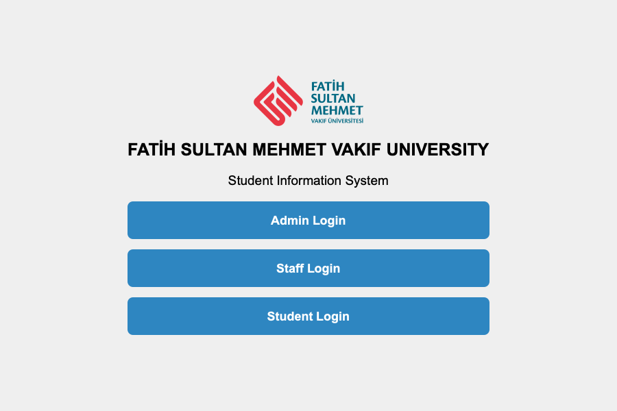
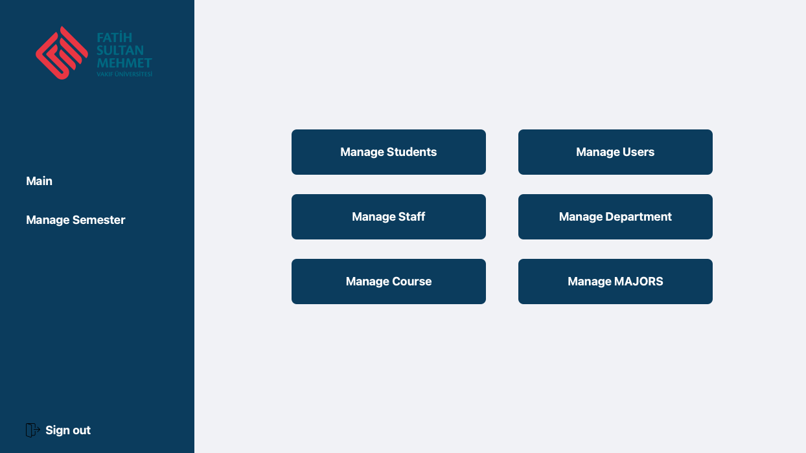
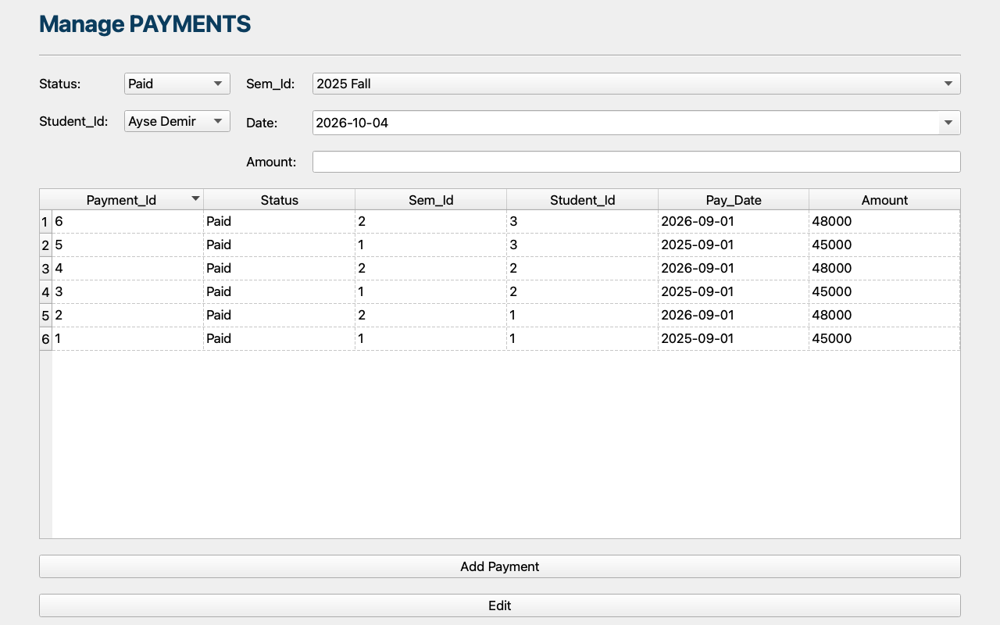
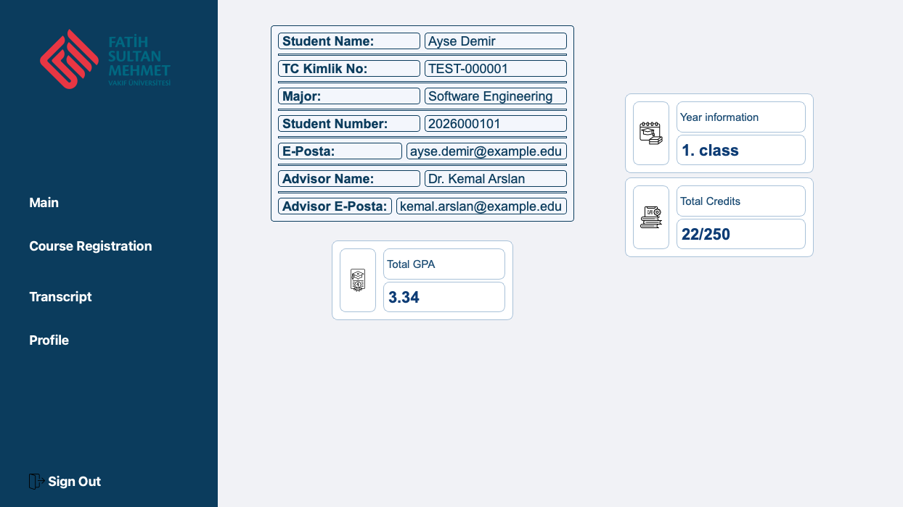
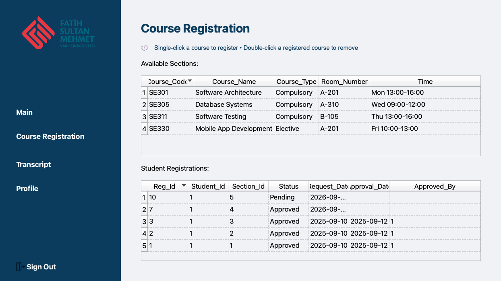
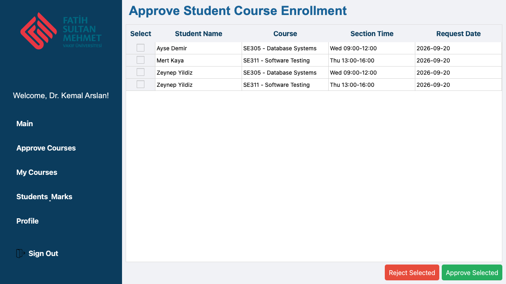
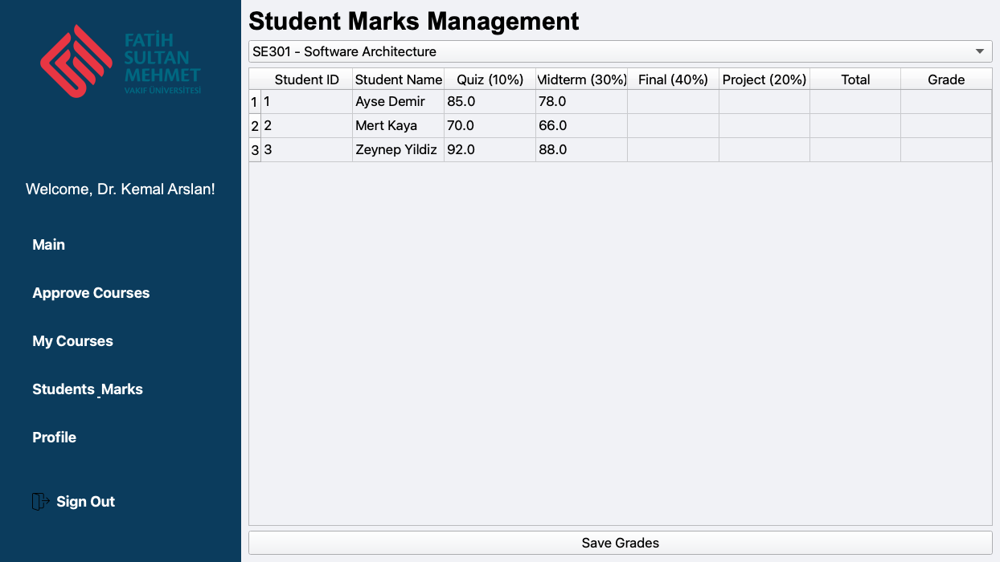
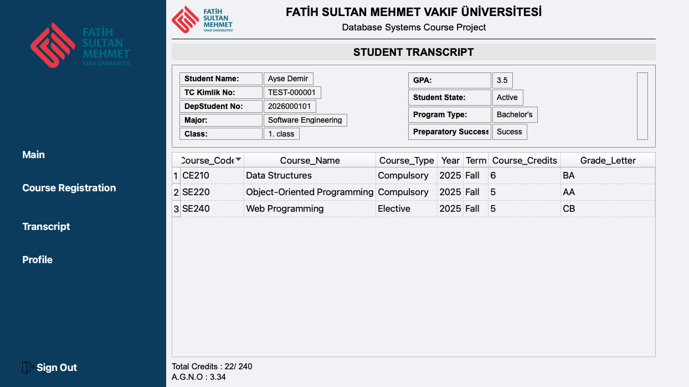

# 🎓 Student Registration System

**A desktop student information system with Admin, Instructor and Student roles: course registration with advisor approval, grading, transcripts and tuition payments, built with PyQt5 and SQLite.**

<p>
  
  
  
</p>

👥 Team: Saed O S Radi, Abdulrahman Zeineddin, and Zigzag2Z — university course project (FSMVU)

---

## Overview

The app is a university **student information system** (in the style of an OBS, *Öğrenci Bilgi Sistemi*) built as a Database Systems course project. A launcher lets users sign in as an **Admin**, a **Staff member (instructor)** or a **Student**, and each role gets its own dashboard. All data lives in a local SQLite database that the app creates, together with its schema, on first launch.

<p align="center">
  
</p>

## Features

### 🛠️ Admin
- Manage **students**, **instructors (staff)**, **courses**, **departments**, **majors** and **user accounts** (add / edit / delete)
- Semester management: **semesters**, **classrooms**, **course sections** (room, instructor, time) and **tuition payments**

### 👩‍🏫 Instructor
- Home dashboard with pending approvals, active courses, total students and today's schedule
- **Approve or reject** course registration requests from advisees
- **My Courses**: sections taught, with enrolment against classroom capacity
- **Marks entry** per section: Quiz (10%), Midterm (30%), Final (40%) and Project (20%), with weighted total and letter grade
- Profile page

### 🧑‍🎓 Student
- Dashboard with personal info, advisor, year, total credits and GPA
- **Course registration** for the current semester's sections. A request is created as *Pending* for advisor approval and is only allowed once the semester fee is marked *Paid*. Students can withdraw a request.
- **Transcript** with completed courses, letter grades, total credits and cumulative GPA (A.G.N.O.)
- Profile (phone, address, birth date, gender, nationality, photo)

## Screenshots

*Captured from the running app with fictional test data.*

| Admin dashboard | Admin: tuition payments |
|:---:|:---:|
|  |  |

| Student dashboard | Course registration |
|:---:|:---:|
|  |  |

| Instructor: approvals | Instructor: marks entry |
|:---:|:---:|
|  |  |

| Student transcript |
|:---:|
|  |

## Database Schema

`deb_con.py` creates 16 tables on first launch (`CREATE TABLE IF NOT EXISTS`):

| Table | Purpose / key columns |
|---|---|
| `USERS` | Login accounts: `Username`, `Password`, `Role` (Admin / Instructor / Student) |
| `DEPARTMENTS` | `Department_Name`, `Head_Instructor_Id` |
| `MAJORS` | `Major_Name` → `DEPARTMENTS` |
| `INSTRUCTORS` | Name, email → `DEPARTMENTS`, `USERS` |
| `STUDENTS` | Student number, name, email, `TC_Kimlik` → `USERS`, `MAJORS`, advisor (`INSTRUCTORS`) |
| `PROFILE` | Student contact and personal details, photo path |
| `COURSES` | Code, name, credits, type (compulsory / elective) |
| `SEMESTERS` | Year, term, start and end dates |
| `CLASSROOMS` | Building, room number, capacity, type |
| `SECTIONS` | Course offering: course, instructor, room, semester, time |
| `STUDENTS_REGISTRATIONS` | Student ↔ section, `Status` (Pending / Approved / Denied), request and approval dates, approver |
| `ASSESSMENTS` | Per-registration component grades (Quiz, Midterm, Final, Project) with weights |
| `GRADES` | Final total, letter grade and grade points per registration |
| `PAYMENTS` | Tuition payments per student and semester (status, date, amount) |
| `TRANSCRIPT`, `TRANSCRIPT_DETAILS` | Per-semester GPA and course rows (defined, not populated by the current code) |

**Relationships:** `MAJORS` and `INSTRUCTORS` belong to a `DEPARTMENTS` row. `STUDENTS` link to a `MAJORS` row, an advisor in `INSTRUCTORS` and a login in `USERS`. A `SECTIONS` row ties a `COURSES` row to an instructor, a `CLASSROOMS` row and a `SEMESTERS` row. `STUDENTS_REGISTRATIONS` joins students to sections, and each registration has its `ASSESSMENTS` and one `GRADES` row. `PAYMENTS` link students to semesters.

## Tech Stack

| Area | Tools |
|---|---|
| Language | Python 3 |
| GUI | PyQt5 (Qt Widgets) |
| Database | SQLite via `PyQt5.QtSql` (`QSqlDatabase`, `QSqlQuery`, `QSqlQueryModel`) |

## How to Run

```bash
python -m venv venv
source venv/bin/activate
pip install -r requirements.txt
python Rule.py
```

Run it from the project root: the database (`student_management.db`) and the `assets/` icons are resolved relative to the working directory.

On first launch the app creates the database and a default admin account, **`admin` / `1234`**. Sign in as Admin to add departments, majors, instructors, students, courses, semesters, classrooms and sections. Students can register for courses once a *Paid* payment exists for the current semester.

## Project Structure

```
.
├── Rule.py                       # Launcher: role selection (Admin / Staff / Student)
├── deb_con.py                    # SQLite connection, schema creation, default admin
├── AdminActor/                   # Admin login, dashboard and CRUD screens
│   ├── Course/ Department/ Major/ Staff/ Student/
│   ├── Semester/                 # Semesters, classrooms, sections, payments
│   └── Users.py, ManageSem.py
├── ProfessorActor/               # Instructor login, dashboard and pages
│   └── pages/                    # home, approve, courses, marks, profile
├── StudentActor/                 # Student login, dashboard, registration, transcript, profile
├── StudentAcademicCalculator.py  # Standalone calculator class (commented out, see below)
├── assets/                       # Icons and logo
├── screenshots/                  # README screenshots
└── requirements.txt
```

## Known Limitations

- **Plain-text passwords.** `USERS.Password` is stored and compared as plain text, with no hashing, and a default `admin` / `1234` account is created automatically.
- **SQL built with string formatting.** The login screens and several queries insert user input into SQL with f-strings rather than bound parameters, so they are open to SQL injection.
- **Commented-out GPA calculator.** `StudentAcademicCalculator.py` (term/total credits, term GPA, total GPA) is entirely commented out and unused. The dashboard and the transcript's **A.G.N.O.** use a separate `calculate_gpa()` in `Transcript.py` instead.
- **Hard-coded transcript header.** In the transcript header, **GPA is a fixed "3.5"**, and Student State, Program Type and Preparatory Success Status are fixed text, so the header GPA can differ from the real A.G.N.O. shown below the course table (e.g. 3.5 vs 3.34 in the screenshot).
- **Unused tables.** `TRANSCRIPT` and `TRANSCRIPT_DETAILS` are created but never written by the current code.
- **Desktop-only, local database.** Single-user SQLite file, with no network or multi-user access.
